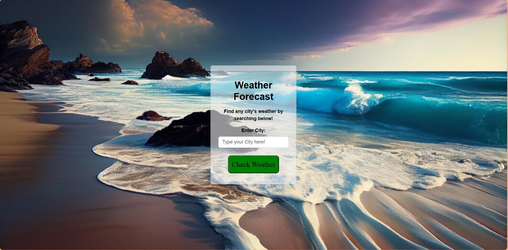
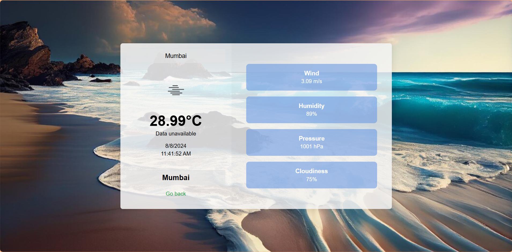

Weather Checker

This project is built with Express JS, NodeJs, HTML, CSS & JS. It also uses OpenWeatherApi which calls and helps us to display the weather of that Specific location. So you need to go to OpenWeatherApi website and generate your own api key and paste it in app.js

# Enter City

# Result

Made by Nishant Acharekar